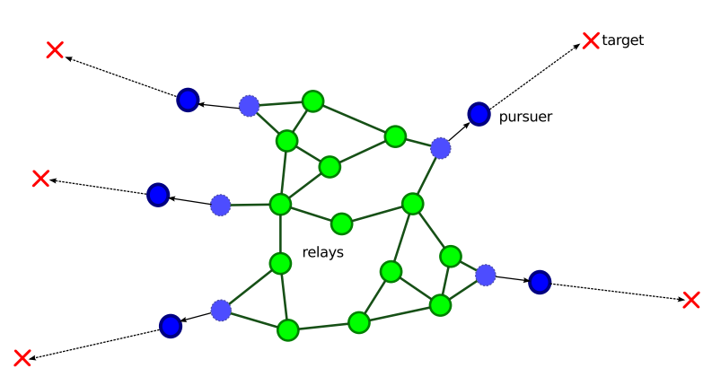

# Swarm

This repo contains only information about a closed source software for the purpose of portfolio.

Swarm is a simulator for the scenario where a swarm of drones is pursuing a set of targets but they cannot let the swarm tear apart.

This is a very dificult problem because each drone acts independently, has only local knowledge an has its own objective, and even with perfect knowledge, the optimum solution for a single time-step takes [exponential time](https://doi.org/10.1109/IROS.2012.6386226) with respect to the number of drones.

The user is able to Edit scenarios agent by agent or in a batch manner and interact with the agents even when the simulation is running.

It was made to develop and test algorithms for this problem, resulting in a state-of-the-art algorithm.

Even some interesting and unexpected behaviors emerged, such as soaking and draining

